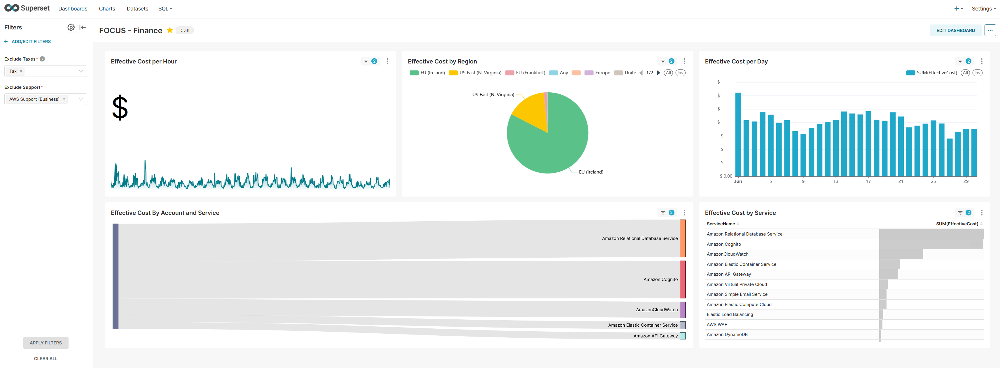
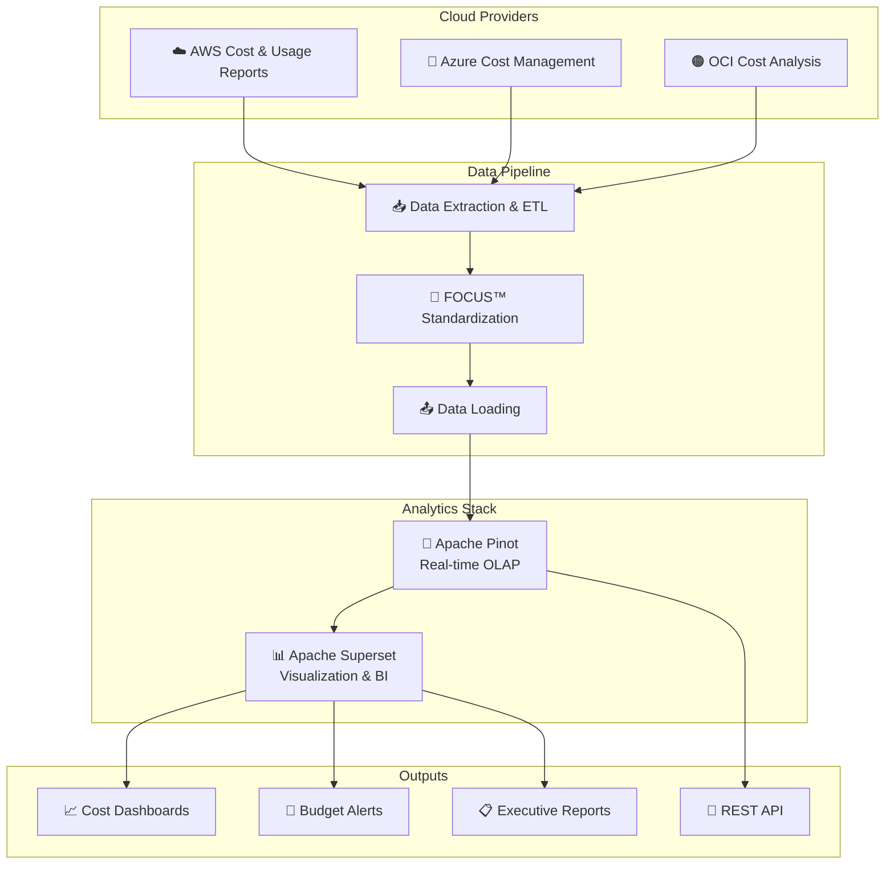

# Multi-Cloud Cost Optimization Dashboard



🚀 **A comprehensive multi-cloud cost optimization and monitoring solution** built with modern data engineering tools for enterprise-grade FinOps operations.

This project provides a unified dashboard for monitoring, analyzing, and optimizing costs across AWS, Azure, and Oracle Cloud Infrastructure (OCI) using the FinOps Cost and Usage Specification (FOCUS™) standard.

## 🌟 Key Features

- 📊 **Real-time cost monitoring** across multiple cloud providers
- 🔄 **FOCUS™ compliant** data standardization
- 🎯 **Cost optimization recommendations** based on usage patterns
- 📈 **Interactive dashboards** with drill-down capabilities
- 🔍 **Anomaly detection** for unusual spending patterns
- 💰 **Budget tracking and alerts**
- 📋 **Executive reporting** with cost attribution
- 🔒 **Multi-tenant support** for different teams/departments

## 🏗️ Technology Stack

### Core Components
- **[Apache Superset™](https://superset.apache.org/)** - Modern data exploration and visualization platform
- **[Apache Pinot™](https://pinot.apache.org/)** - Real-time OLAP datastore for ultra low-latency analytics
- **[FOCUS™](https://focus.finops.org/)** - FinOps Cost and Usage Specification for standardized cloud billing

### Cloud Providers Supported
- ☁️ **Amazon Web Services (AWS)**
- 🔷 **Microsoft Azure**
- 🟠 **Oracle Cloud Infrastructure (OCI)**

## 📖 About the Technologies

### FOCUS™ (FinOps Cost and Usage Specification)
The FinOps Cost and Usage Specification (FOCUS™) is an open-source specification that defines clear requirements for cloud vendors to produce consistent cost and usage datasets.

Supported by the FinOps Foundation, FOCUS™ aims to reduce complexity for FinOps Practitioners so they can drive data-driven decision-making and maximize the business value of cloud, while making their skills more transferable across clouds, tools, and organizations.

🔗 [Learn more about FOCUS](https://www.finops.org/insights/focus-1-0-available/)

### Apache Superset™
Superset is a modern data exploration and data visualization platform that replaces proprietary business intelligence tools. It provides rich interactive dashboards with excellent integration capabilities across various data sources.

🔗 [Apache Superset Documentation](https://superset.apache.org/docs/intro)

### Apache Pinot™
Originally developed at LinkedIn, Apache Pinot™ is a real-time distributed OLAP datastore, purpose-built to provide ultra low-latency analytics at extremely high throughput. Perfect for real-time cost monitoring and anomaly detection.

🔗 [Apache Pinot Documentation](https://docs.pinot.apache.org/)

## 🏛️ System Architecture



## 🎯 Use Cases

### For Finance Teams
- 💳 **Chargeback & Showback** - Accurate cost allocation to business units
- 📊 **Budget Management** - Real-time budget tracking and variance analysis
- 📈 **Trend Analysis** - Identify cost trends and forecast future spending
- 🔍 **Cost Attribution** - Drill-down from high-level costs to specific resources

### For Engineering Teams
- ⚡ **Resource Optimization** - Identify underutilized or oversized resources
- 🔄 **Right-sizing Recommendations** - Data-driven infrastructure optimization
- 📱 **Application Cost Tracking** - Monitor costs by application or service
- 🚨 **Anomaly Detection** - Automated alerts for unusual spending patterns

### For Executive Leadership
- 📋 **Executive Dashboards** - High-level cost summaries and KPIs
- 🎯 **ROI Analysis** - Track return on cloud investments
- 📊 **Multi-cloud Comparison** - Compare costs and efficiency across providers
- 💰 **Cost Governance** - Ensure compliance with spending policies

## 🚀 Quick Start Guide

### Prerequisites
- 🐳 Docker and Docker Compose
- 🐍 Python 3.8+
- 📦 Node.js 16+ (for frontend customizations)
- ☁️ Access to cloud provider billing data

### 1. Clone and Setup

```bash
git clone https://github.com/AKV-7/Multi-cloud-cost-optmisation-dashboard.git
cd Multi-cloud-cost-optmisation-dashboard
```

### 2. Configure Environment

```bash
# Copy environment template
cp .env.example .env

# Edit configuration
nano .env
```

### 3. Start the Stack

```bash
# Start all services
docker compose up -d

# Verify services are running
docker compose ps
```

### 4. Access the Dashboard

- 🌐 **Superset Dashboard**: http://localhost:8088
- 📊 **Pinot Console**: http://localhost:9000
- 📈 **API Documentation**: http://localhost:8080/docs

Default credentials:
- Username: `admin`
- Password: `admin`

## 📥 Data Ingestion Setup

### Step 1: Configure Cloud Provider Exports

#### AWS Cost and Usage Reports
```bash
# Configure AWS CLI
aws configure

# Download AWS FOCUS exports
./scripts/download_focus_export.sh \
    -p aws \
    -b your-cur-bucket \
    -e your-export-name \
    -d reports/cur \
    -o ./exports/aws/
```

#### Azure Cost Management
```bash
# Configure Azure CLI
az login

# Download Azure FOCUS exports
./scripts/download_focus_export.sh \
    -p azure \
    -b your-storage-account \
    -c cost-exports \
    -e your-export-name \
    -d cost-data \
    -o ./exports/azure/
```

#### Oracle Cloud Infrastructure
```bash
# Configure OCI CLI
oci setup config

# Download OCI FOCUS exports
./scripts/download_focus_export.sh \
    -p oci \
    -b your-oci-bucket \
    -o ./exports/oci/
```

### Step 2: Initialize Data Pipeline

```bash
# Start the data pipeline
./scripts/init-pipeline.sh

# Monitor ingestion progress
./scripts/monitor-ingestion.sh
```

### Step 3: Configure Dashboards

```bash
# Import pre-built dashboards
./scripts/import-dashboards.sh

# Configure alerts and notifications
./scripts/setup-alerts.sh
```

## 📊 Dashboard Features

### Cost Overview Dashboard
- 💰 Total spend across all clouds
- 📈 Month-over-month cost trends
- 🥧 Cost breakdown by cloud provider
- 📊 Top 10 most expensive services

### Resource Optimization Dashboard
- 🔍 Underutilized resources identification
- 💡 Right-sizing recommendations
- 📉 Potential savings calculations
- ⚡ Performance vs cost analysis

### Budget Management Dashboard
- 🎯 Budget vs actual spending
- 🚨 Budget alerts and thresholds
- 📅 Forecast vs actual spending
- 🏷️ Cost allocation by tags/labels

### Executive Summary Dashboard
- 📋 High-level KPIs and metrics
- 📈 Spending trends and projections
- 🎯 Cost optimization ROI
- 📊 Multi-cloud cost comparison

## 🔧 Configuration

### Environment Variables

```bash
# Database Configuration
PINOT_CONTROLLER_HOST=localhost
PINOT_CONTROLLER_PORT=9000
PINOT_BROKER_HOST=localhost
PINOT_BROKER_PORT=8000

# Superset Configuration
SUPERSET_SECRET_KEY=your-secret-key
SUPERSET_DATABASE_URI=sqlite:///superset.db

# Cloud Provider APIs
AWS_ACCESS_KEY_ID=your-aws-key
AWS_SECRET_ACCESS_KEY=your-aws-secret
AZURE_CLIENT_ID=your-azure-client-id
AZURE_CLIENT_SECRET=your-azure-secret
OCI_CONFIG_PROFILE=your-oci-profile
```

### Custom Schemas

The system supports custom FOCUS™ schemas for different organizational needs:

```yaml
# config/custom-schema.yaml
schema:
  dimensions:
    - business_unit
    - cost_center
    - project_code
    - environment
  metrics:
    - blended_cost
    - unblended_cost
    - usage_quantity
    - amortized_cost
```

## 🔐 Security Features

- 🔑 **Role-based Access Control (RBAC)**
- 🔒 **SSO Integration** (SAML, OAuth)
- 🛡️ **Data Encryption** at rest and in transit
- 📝 **Audit Logging** for all user actions
- 🚫 **Data Masking** for sensitive information

## 📈 Performance Optimization

### Pinot Optimization
- 📊 **Pre-aggregated tables** for faster queries
- 🔍 **Inverted indexes** on high-cardinality dimensions
- 💾 **Smart caching** strategies
- ⚡ **Real-time ingestion** optimization

### Superset Optimization
- 🔄 **Query result caching**
- 📊 **Dashboard performance tuning**
- 🚀 **Async query execution**
- 📱 **Mobile-responsive dashboards**

## 🧪 Testing

```bash
# Run unit tests
pytest tests/unit/

# Run integration tests
pytest tests/integration/

# Run performance tests
pytest tests/performance/

# Generate test coverage report
pytest --cov=src tests/
```

## 🚀 Deployment

### Production Deployment with Kubernetes

```bash
# Deploy to Kubernetes
kubectl apply -f k8s/

# Monitor deployment
kubectl get pods -n finops-dashboard

# Access via LoadBalancer
kubectl get svc -n finops-dashboard
```

### Docker Swarm Deployment

```bash
# Initialize swarm
docker swarm init

# Deploy stack
docker stack deploy -c docker-compose.prod.yml finops

# Scale services
docker service scale finops_superset=3
```

## 🤝 Contributing

We welcome contributions! Please see our [Contributing Guide](CONTRIBUTING.md) for details.

### Development Setup

```bash
# Fork and clone the repository
git clone https://github.com/your-username/Multi-cloud-cost-optmisation-dashboard.git

# Create development environment
python -m venv venv
source venv/bin/activate  # or `venv\Scripts\activate` on Windows

# Install dependencies
pip install -r requirements-dev.txt

# Run pre-commit hooks
pre-commit install
```

### Code Style

We use:
- 🐍 **Black** for Python code formatting
- 📝 **Prettier** for JavaScript/TypeScript
- 🔍 **ESLint** for JavaScript linting
- 🧪 **pytest** for testing

## 📚 Documentation

- 📖 [User Guide](docs/user-guide.md)
- 🛠️ [API Documentation](docs/api.md)
- 🏗️ [Architecture Guide](docs/architecture.md)
- 🔧 [Configuration Reference](docs/configuration.md)
- 📊 [Dashboard Gallery](docs/dashboard-gallery.md)

## 📄 License

This project is licensed under the Apache License 2.0 - see the [LICENSE](LICENSE) file for details.

## 🙏 Acknowledgments

- **FinOps Foundation** for the FOCUS™ specification
- **Apache Software Foundation** for Superset and Pinot
- **Cloud providers** for their cost management APIs
- **Open source community** for continuous contributions

## 📞 Support

- 🐛 **Bug Reports**: [GitHub Issues](https://github.com/AKV-7/Multi-cloud-cost-optmisation-dashboard/issues)
- 💬 **Discussions**: [GitHub Discussions](https://github.com/AKV-7/Multi-cloud-cost-optmisation-dashboard/discussions)
- 📧 **Email**: support@finops-dashboard.com
- 📚 **Documentation**: [Wiki](https://github.com/AKV-7/Multi-cloud-cost-optmisation-dashboard/wiki)

---

⭐ **Star this repository** if you find it helpful!

🔄 **Follow** for updates on new features and releases!
